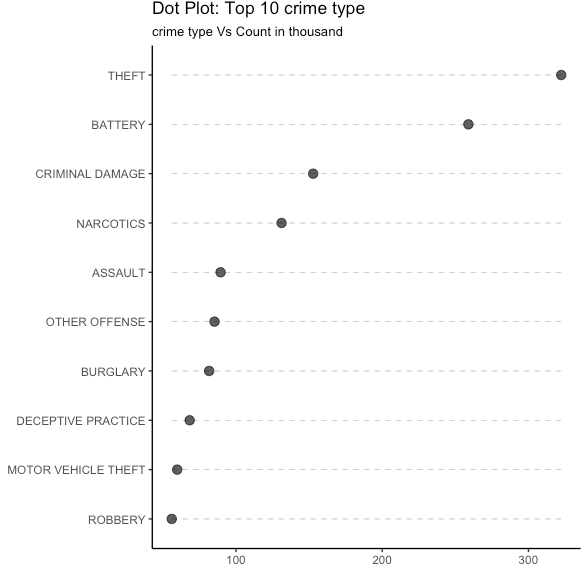

  
  
  
  

This project was inspired out of a curiosity for assessing crime rates throughout Chicago’s various different neighborhoods. Using Tableau, R statistical analysis, and the 2012 – 2016 crime data from Kaggle, my team and I investigated the different types of crimes that occurred, the arrest rates, and the frequency and time of year they took place. This investigation covered 3 different techniques for analyzing the crime dataset: exploratory graphs (dot and bar charts and treemaps), time series (line plots and heat maps), and geographical graphs.

Here is What we Found out:

* Crime Hot Spots: downtown, southside, and area between Oak Park and Downtown
* Overall crime in Chicago has declined from 2012 to 2016
* Top crime types committed were theft and battery
* Recurring high crime rate during the summer periond (June - August) every year

You can learn more about the results and codes at my [GitHub Portfolio](https://github.com/JasonWu1211/Portfolio/tree/master/Data%20Visualization%20-%20Chicago%20Crime%20%7C%20R).

